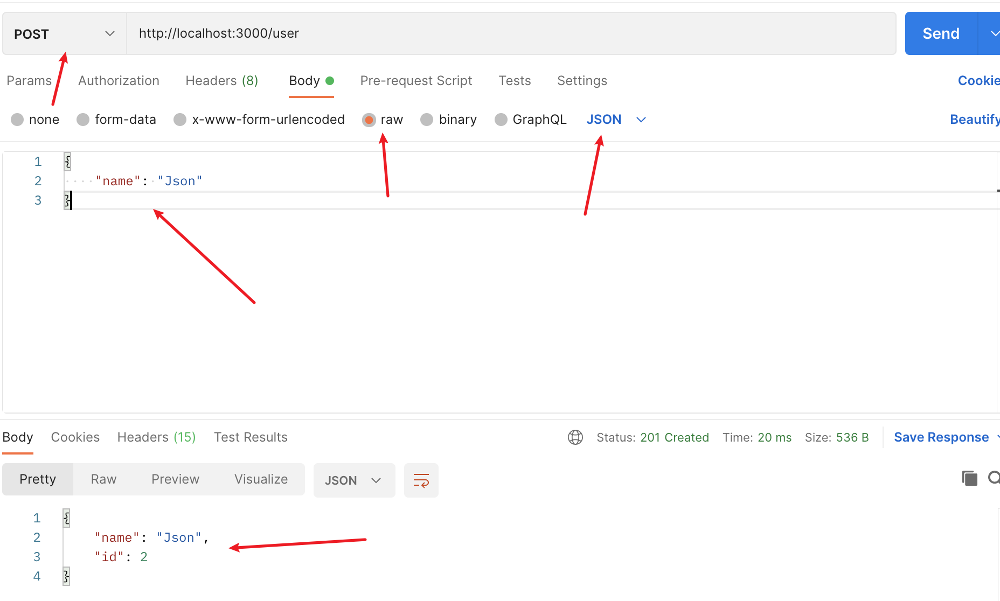

jira 项目需要用到的技术栈： React + hooks + ts + react-query(这是啥？) + react-router + react-toolkit + css in js

react-query 来管理**服务端**全局状态
redux toolkit 管理**客户端**全局状态

可以多对比 React 17 教程

#### 2-1 用 Create react app 初始化项目

如何初始化一个 ts + react 项目方法就不说了。 React17 项目笔记已经说得非常明白了

初始化项目后：src 文件夹里的 react-app-env.d.ts、reportWebVitals.ts、setupTests.ts 这三个文件需知道是有什么作用(目前还未知，但项目完成之后应该是要知道才行的)

**注意**: 源代码里如果要使用图片、字体、文件都应该放在 src 文件夹里，然后放在项目里如模块一般使用，而不是放在如 pulic 这类在 src 文件夹之外的文件里

#### 2-2 配置 eslint、prettier 和 commitlint 规范工程

这一节的配置内容，对于团队的合作、代码格式化有好处(和本次项目其实关系不太大)

**问题 1: 引用文件 相对路径过长**

```
例如： import { calculate } from '../../entry....

解决办法：
首先，在tsconfig.json 文件 加一个配置
"baseUrl": "./src"    // 表示绝对路径会去src文件夹下去找
此时，就可以直接写成  import { calculate } from 'entry';   // 但其实还是有点懵
```

导入文件： import ... from './' 和 没有 './'有啥区别？

**格式化代码**
这个感觉挺牛逼的(挺方便的，只要提交到 git，就会自动格式化代码)
让团队写代码有统一规范的格式：
Prettier 工具
首先安装 Prettier：

```
npm install --save-dev --save-exact prettier

echo {}> .prettierrc.json    // echo 是新建一个文件的意思

npx mrm lint-staged    // Prettier hooks
 npm add eslint-config-prettier// 对eslint 要有一些配置
 .... 还是看视频吧...
```

和 vscode 的 prettier 还是有点区别

**提交 commitlint 这个我其实觉得不太方便，算了，不用，有兴趣就看**

#### 2-3 对比常见 Mock 方案 配置 JSON SERVER

(由于在真实环境中，后端和前端并行开发，所以在前期是没有后端接口可以使用的，所以学会最适合自己的 Mock 数据的方法就是非常重要的，下面列举业界常见的 Mock 方案，并选择其中最合适的方案)

##### 1.代码侵入(直接在代码中写死 Mock 数据，或者请求本地的 JSON 文件)

说实话，React 17 就是用的这种方法 估计是应该项目比较简单的原因

优点: 无
缺点:

1. 和其他方案比 Mock 效果不好
2. 与真实 Server 环境的切换非常麻烦(应该不麻烦吧？！)，一切需要侵入代码切换环境的行为都是不好的

##### 2.请求拦截

代表: Mock.js (这是啥？没用过)
帮我们生成随机数据

优点:

1. (相对于代码侵入而言)与前端代码分离
2. 可生成随机数据

缺点:

1. 数据都是动态生成的假数据，无法真实模拟增删改查的情况
2. 只支持 ajax,不支持 fetch

##### 3. 接口管理工具

代表: rap、swagger, moco, yapi(大公司才有)

优点：

1. 配置功能强大，接口管理与 Mock 一体，后端修改接口 mock 也跟着更改，可靠

缺点：

1. 配置复杂，依赖后端，可能会出现后端不愿意出售，或者等配置完了，接口也开发初拉力了的情况。
2. 一般作为大团队的基础建设而存在，没有这个条件的话慎重考虑

##### 4. 本地 node 服务器

代表：json-server

优点：

1. 配置简单，json-server 甚至可以 0 代码，30 秒就启动一个 REST api Server(又是 rest api)
2. 自定义程度高，一切尽在掌握中
3. 增删改查真实模拟
   缺点：
4. 与接口管理工具相比，无法随着后端 api 的修改而自动修改(这个自己也用不着)

```
安装方法：
npm i json-server -g   // 加上sudo 表示全局

启动server： json-server --watch json文件

结合postman 来使用
```

使用 Postman 注意下图几点
必须是 POST 请求 才能设置请求体。且格式应该为 json


有一个比较神奇的点： 我通过 postman 可以更改已经有的数据。更改方法竟然是先在 url 后面/id 跟一个要更改内容的 id。 然后把请求方式改为 PATCH。这是什么操作？(为什么会这样？)。删除方式就是 DELETE

url 后跟参数，这里的内容要多研究研究啊

妈的，什么时候我竟然安装了 yarn 的！哈哈

```
在项目中使用json-server
1. yarn add json-server -D
2. 在根目录新建一个文件夹：__json_server_mock__ (前面__表示文件夹是作为辅助文件存在的)
3. ...
4. 运行： npm run json-server
```

[fetch 知识](https://zhuanlan.zhihu.com/p/24594294)

[PATCH 和 PUT 方法的区别](https://segmentfault.com/q/1010000005685904)

#### 3-1 用 JSX 列表渲染开发工程列表页面

先用 js 来写列表渲染。后面再用 ts 来写

这里很有意思，把一个大组件(ProjectListScreen) 由几个小组件(List 组件、SearchPanel 组件)来拼凑出来

并且这个项目中，起文件名的方式是 - 代替驼峰命名(search-panel 代替 SearchPanel)

> 这一节的重点在于 js 和 react 结合后对于 input、option、onChange 的掌握如何！

**因此，总结一点小知识**

- input 标签 常用 的 type 类型
- onChange 事件 e.target.value 的用法

[上述两个问题的解答](https://zh-hans.reactjs.org/docs/forms.html)

- response.ok 代替了 try……catch？
  该属性是来检查 response 的状态是否在 200 - 299（包括 200 和 299）这个范围内。该属性返回一个布尔值
